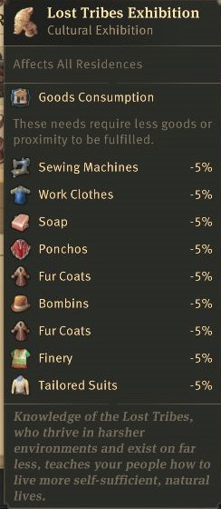

# Patch-Notes for Version 0.0.1
## Palace
- Maximum prestige level 25 -> 10
- but maximum of 50%
- Department of Administration = Workforce ~~300~~ -> 150
- Department of Labour = Trade Union Buff ~~60%~~ -> 30%
- Department of Culture = Specialist Buff ~~120%~~ -> 60%
- Department of Labour = Harbourmaster Storage ~~1200~~ -> 600

I didn't change the Department of Welfare since i do not see the reason, it wouldnt increase any difficulty and would just make planning more annoying.
## Research
- Institute usable ~~10'000~~ -> 100'000 Engineers equals 1 min
- Moving and Godlike researchs start 25000 points with 25000 for each more due to increased rates of research points and to use some fertillity items (and not having them rendered useless), removing the limits, i know that this also effects great eastern, this is currently intended, lategame people ONLY use them, rendering every other ship useless
## Hacienda
### Policies
Specialised Lumberjack Training
Affects Lumberjack's Huts and Sawmills, and New World Orchards on island Productivity +20%
~~Maintenance Cost -20%~~ Extra Goods: Occasionally produces extra outputevery 3rd cycle
## Items
### Pedologists
Effects
Productivity: +20%
Workforce Needed: +35%
Maintenance Cost: +125%
New Input
The building now processes Dung Dung.
Extra Goods
now: 1 every 2 cycles
## Zoo
### Abyssal Depth
~~Effect: Salvager get increased chance of finding Epic and Legendary animals.~~

All Fisheries (Fishery, Fish Oil Fabric, Lobstery and Calamari Fishery) adding 1 (Fishery, Fish Oil, Lobster and Calamari) every 10th cycle.

### Cordillera
- ~~Farmer Residence, Jornalero Residence, and Hacienda Jornalero Quarters~~ -> Residences
- 
### Domestic Animals
~~Effect: Animal Farms have +5% production and -10% maintenance cost.~~

Effect: Applies to: all Old World Animal Farms
Productivity: +25%
No. of Modules: -25%
Extra Goods: Occasionally produces extra outputevery 3rd cycle

### Eastern Jungle
~~Effect: Harbor Activity +100%. Every time passive trade happens at the trading post, there is a chance of gaining 5t of Coffee Beans, Sugar Cane, Tobacco, Cotton, Cocoa, Plantains, Pearls, Chocolate, Coffee, Fried Plantains, Tortillas, or Sugar.~~

Gets additional research points for: leather Shoes, rum, bombin, Tea, Tapestries, Tobacco Pipe(5 ea).

### Enbesean Highlands
Effect: Scholar Residence Scholar Residence
~~Consumption of Seafood Stew: -10%
Consumption of Hibiscus Tea: -10%~~

Gets additional research points for: canned food, Suits, Spicy Stew, Telephones, phonographs, electricity, radio tower (5 ea).

### Great Coral Reef
Effect: ~~+2~~ +5 Happiness and +2 Attractiveness ~~(affects Worker Residence, Artisan Residence, Obrero Residence, and Hacienda Obrera Quarters).~~ -> Residences

### Luminaries
Effect: ~~+3~~ +5 Attractiveness from Pubs, Variety Theatres, Members Clubs, Shopping Arcades and Restaurants (non-monument).

Adding Universities, Marcetplace and Schools.

### Miombo Woodlands
Effect: Applies to: Lumberjack's Hut, Charcoal Kiln, Hunting Cabin, all Orchards, Reduces the number of trees needed to reach optimal productivity by 15%

Attractiveness: +5

### Ocean Predetors
Effect: All Coastal Production Buildings receive ~~+10%~~ +30% productivity, -10% maintenance cost, and require 5% less workforce.

Fusing Ocean Predators with Teeming Lakes buff.

### Rainforest
~~Effect: +30 Attractiveness from all Trade Unions.~~ -> Effect: +10 Influence from Town Halls & Trade Unions

With the change for the maximum prestige bonuses the need to raise the attractiveness is reduced, while still maintaining the influence need. So i decided to move the influencereduction to a 6 piece set and the attractiveness to a 3 piece set.

### Taiga Forest
Effect: Residents consume 5% less Fish, Bread, Canned Food, Sausages, Chocolate, Fried Plantains, Tortillas and Seafood Stew.

Adding Pemmican, Dried Meat, Chewing Gum and Biscuits

### Teeming Lakes
~~Effect: +20% Productivity for all Coastal Production Buildings~~

Effect: all harbour buildings: loading speed +15%

## Museum
### Aegean Cultures
Effect: +5 Attractiveness and 20% reduced maintenance from Variety Theatres, Museums and Radio Towers. Variety Theatres have new tooltips displaying which play they are currently staging.

Adding Pub and 10% distance.

### Atlantean
~~Effect: Salvager get increased chance of finding Epic and Legendary artefacts.~~

All trade ships and airsips: Movement Speed: +5%, Loading Speed: +20%

### Battle of Trelawney
<!--Uniquebuff (2 pieces only one time quest reward in vanilla), area = 1 island
Reduce all skyscraper maintenancecost by.... 40%
reduce all maintenancecost by 40%
oder oil refinery produces gas
oder elektro laufen 30% langsamer-->
~~Effect: +20% increased damage to sailing ships
Unwavering: your ship deals increased damage when its hitpoints are running low~~

Effect: +20% increased speed for all ships

### Bronze Age
Effect: Affects Lumberjacks' Huts, Hunting Cabins, Quarries and all Old and New World Orchards.
~~+5%~~ 20% productivity, +5 Attractiveness and extra goods (extra output of the produced good: 1 extra ton per 10 cycles)

### Empire of the Eagle
Effect: ~~+5%~~ +10% increased income from Residences. 10% reduced chance of fires, illness, riots and explosions from Residences.

### Gods of Delta
Effect: +30 Attractiveness ~~and +10 Influence~~ from Town Halls & Trade Unions

With the reduced maximum prestige level there is currently no need to buff it to 60 to match Gods of Delta AND Rainforest

### Heirlooms of the Gold-Realm
~~Effect: Applies to: Trading Posts and Piers. Harbor Activity: 20%. Every time passive trade happens at the trading post, there is a chance of gaining 5t of Gold Gold, Jewellery Jewellery.~~

Effect: Residents consume 5% less "shiny stuff": Jewellery, Pocket Watches, Gramopones, Glasses, Light Bulbs

### Icebound
Effect: Maintenance Cost: -20% affecting All Food Production, All Drinks Production Buildings, Chemical Plant: Lemonade, Orchard: Jam, Assembly Line: Biscuits, Artisan's Workshop: Cognac, and Chemical Plant: Chewing Gum.

Adding Productionboost (20%) and reducing workforce (10%)

### Lost Cities
~~Effect: Harbour Activity +100%. Every time passive trade happens at the trading post, there is a chance of gaining 5t of Gold Ore, Gold or Jewellery~~

Effect: all coastal defense +20% dmg and 1000 hitpoints

### Lost Tribes
Effect: Residences have -5% consumption of Sewing Machines, ~~Canned Food and Coffee~~.

Adding non-luxury non-food products: working clothes, soap, fur coats, ponchos, bombins, tailored suits, finery

### New World Huaca
Effects: Increased Visits: ~~+5%~~+20%. Increases the chance of specialists visiting your island.
Special Guests: Unique specialists (removing common, uncommon and rare pool {leaving epic [40%] and legendary [60%]}) may visit your city.

### Nothern Sagas
Effect: unwavering (minimum dmg +50%), +5% maximum hitpoints and +23% increased damage, +3% increased speed, -5% maintenance cost, and 10% damage slowdown for all warships

Fusion of all current warship sets into one.

### Roots of Enbesa
Effect: Scholar Residences gain ~~+1~~ +25 research points

### Skull and Bones
~~Effect: +3% increased speed, -5% maintenance cost, and 10% damage slowdown for all warships~~

Police Station are upgraded with 2 pirates and faster (15%) to destroy the riots!

## Botanic
### Amazonas
Old World Effect: Grape fertility provided and ~~+25% productivity~~ -10% modules for Vineyards

New World Effect: Plantain Fertility provided and ~~+25% productivity~~ -10% modules for Plantain Plantations

### Andean
Old World Effect: Grain fertility provided and ~~+25% productivity~~ -10% modules for Grain Farms

New World Effect: Coffee fertility provided and ~~+25% productivity~~ -10% modules for Coffee Plantations and Hacienda Coffee Farms

### Enchanted
Old World Effect: Hops Fertility provided and ~~+25% productivity~~ -10% modules for Hops Farms.

New World Effect: Tobacco Fertility provided and ~~+25% productivity~~ -10% modules for Tobacco Plantations. 

### Marshland
Effect: Happiness ~~+2~~ +5, Chance of Illness -50% (affects all residences)

### Near East
Old World Effect: Red Pepper Fertility provided and ~~+25% productivity~~ -10% modules for Red Pepper Farms.

New World Effect: Sugar Cane Fertility provided and ~~+25% productivity~~ -10% modules for Sugar Cane Plantations and Hacienda Sugar Cane Farms.

### Sacred
~~Effect: Harbor activity +100%, Passive Trade chance for 5t of Coffee Beans, Cocoa, Plantains, Pearls, Felt, Bread, Grapes, or Chocolate ~~

Effect: all buildings -20% incidents except illness.

### Subalpine
Old World Effect: Fur Abundance provided and ~~+25% productivity~~ -10% area for Hunting Cabins

New World Effect: Caoutchouc fertility provided and ~~+25% productivity~~ -10% modules for Caoutchouc Plantations and Hacienda Caoutchouc Plantations

# TBD
## Flavor Texts
adding effects to flavor text in zoo, museum and garden
## Docklands
### Nerf
- Fixing the import of some stuff
- NOTE: probably removing Coffee, Chocolate, Champaign, Steam Carriages
- Probably Importing all Base needs, except above, removing all luxury needs